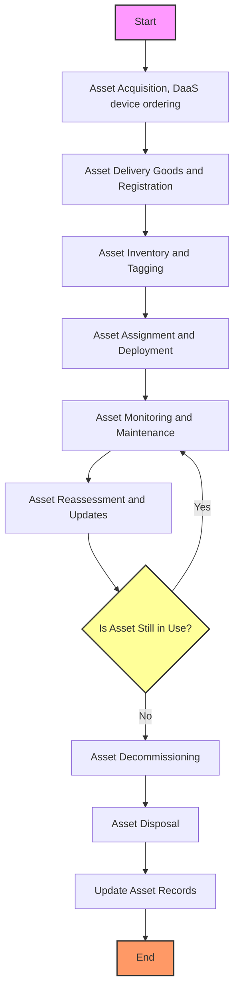

```mermaid
flowchart TD
    A[Start] --> C[Asset Acquisition, DaaS device ordering]
    C --> D[Asset Delivery Goods and Registration]
    D --> E[Asset Inventory and Tagging]
    E --> F[Asset Assignment and Deployment]
    F --> G[Asset Monitoring and Maintenance]
    G --> H[Asset Reassessment and Updates]
    H --> I{Is Asset Still in Use?}
    I -->|Yes| G
    I -->|No| J[Asset Decommissioning]
    J --> K[Asset Disposal]
    K --> L[Update Asset Records]
    L --> M[End]

    %% Styling for clarity
    style A fill:#f9f,stroke:#333,stroke-width:2px
    style M fill:#f96,stroke:#333,stroke-width:2px
    style I fill:#ff9,stroke:#333,stroke-width:2px
```
